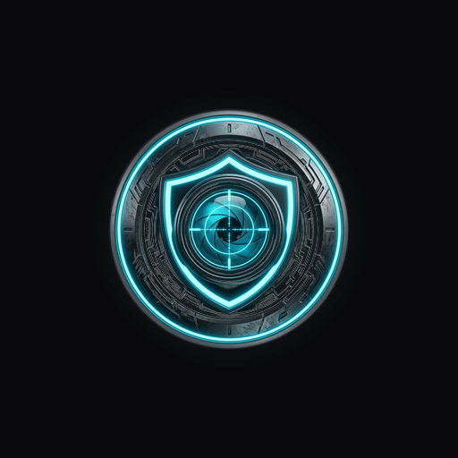
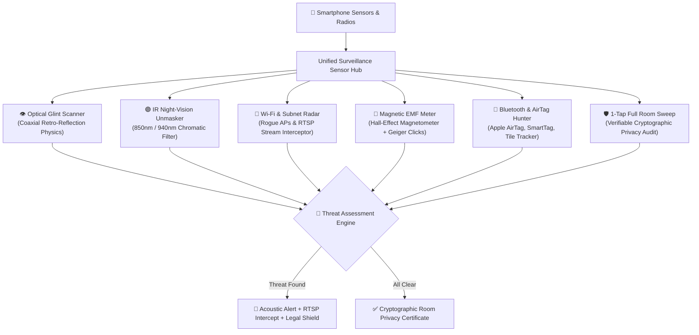
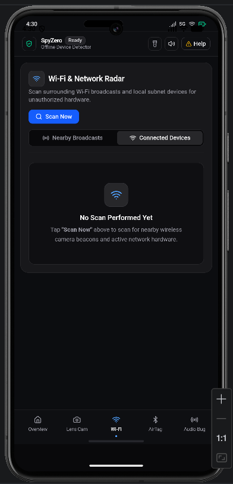

<div align="center">



# 🛡️ SpyZero
### Multi-Vector Counter-Surveillance & Hardware Privacy Platform

[](https://tinyurl.com/29nqw9mz)
[](#-apple-ios-installation-guide)
[](https://react.dev/)
[](https://capacitorjs.com/)
[](https://www.typescriptlang.org/)
[](https://tailwindcss.com/)
[](#-security--privacy-architecture)
[](LICENSE)

<br/>

> **An advanced, privacy-first counter-surveillance mobile suite designed to detect covert pinhole spy cameras, hidden microphones, Bluetooth stalker tags, and unauthorized video streaming hardware in hotel rooms, Airbnbs, trial rooms, and confidential environments.**

<br/>

[📥 Mobile Installation](#-mobile-installation--download) • [⚡ Core Detection Capabilities](#-core-detection-capabilities) • [🔬 Architecture](#-multi-vector-detection-architecture) • [📱 UI Previews](#-mobile-interface-preview) • [🚨 Emergency Protocol](#-emergency-protocol--evidence-chain) • [🛠️ Developer Quickstart](#-developer-quickstart)

---

</div>

<br/>

## 📥 Mobile Installation & Download

SpyZero is ready for direct installation on both **Android** and **iOS** devices. Choose your preferred method below:

### 🤖 Android Installation (2 Methods)

<div align="center">

| Method | How It Works | Download Link / Action |
| :--- | :--- | :--- |
| **Method 1: Direct File Share** | Send clean **`SpyZero.apk`** via WhatsApp, Telegram, or Drive | File located in repo: [`SpyZero.apk`](./SpyZero.apk) |
| **Method 2: Mobile Chrome Browser** | 1-Tap direct download via mobile Chrome | [👉 **Download SpyZero.apk**](https://tinyurl.com/29nqw9mz) |

</div>

#### Step-by-Step for Chrome Download:
1. Open **Google Chrome** on your Android phone.
2. Tap the direct link: **[https://tinyurl.com/29nqw9mz](https://tinyurl.com/29nqw9mz)** *(or mirror: `https://github.com/Kavin-124/SpyZero/raw/main/SpyZero.apk`)*.
3. Chrome will prompt: *"File might be harmful. Do you want to download SpyZero.apk anyway?"* ➔ Tap **Download anyway**.
4. Once downloaded, open the notification or Files app and tap **Install** *(Enable "Allow from this source" if prompted)*.
5. Launch **SpyZero** and grant Camera / Bluetooth / Location permissions to begin sweeping!

---

### 🍏 Apple iOS Installation Guide

Apple restricts raw sideloading of APK binaries, but SpyZero can be installed seamlessly on iPhones via **3 methods**:

#### 🌟 Option A: Instant PWA "Add to Home Screen" *(Recommended — 100% Free & Fast)*
1. Open SpyZero in **Safari** on your iPhone *(via your hosted web deployment or local Wi-Fi)*.
2. Tap the **Share icon** *(Square with arrow pointing up ⬆️)* at the bottom toolbar.
3. Scroll down and tap **"Add to Home Screen"**.
4. Tap **Add**. A native **SpyZero** icon will appear on your Home Screen!
5. Open it to experience a full-screen, standalone app with native camera, torch, and sensor access with zero browser toolbars.

#### 💻 Option B: Native Capacitor iOS App *(Requires Mac + Xcode)*
```bash
# Add and launch iOS native workspace
npx cap add ios
npx cap sync ios
npx cap open ios
```
Connect your iPhone via USB, select your free Personal Apple ID signing certificate in Xcode, and click **Run (▶️)** to install the native `.ipa`.

#### 🚀 Option C: TestFlight Public Distribution
If you maintain an Apple Developer Account ($99/year), compile an Archive build in Xcode and distribute SpyZero via a single-click **TestFlight Public Beta Link**.

---

## ⚡ Core Detection Capabilities

SpyZero integrates 6 distinct sensor vectors into a unified forensic dashboard:



---

## 🔬 Multi-Vector Detection Matrix

| Vector / Tool | Hardware Engaged | Target Threat | Output & Forensic Detection Logic |
| :--- | :--- | :--- | :--- |
| **👁️ Optical Lens Glint** | High-Res Camera + Strobe Flashlight | Pinhole optical apertures (1–2 mm) | Exploits retro-reflection of curved glass lens elements with targeting reticle HUD |
| **🟣 IR Night-Vision** | CMOS Sensor Exposure | Invisible night-vision LED arrays | Chromatic bandpass filtering reveals 850nm / 940nm emitters as vibrant violet blooms |
| **📶 Wi-Fi & Network Radar** | Wi-Fi Radio + Subnet Prober | Spy cam boards (`CAM_A9`), IoT modules | Scans rogue AP broadcasts, matches vendor OUIs (Tuya, Espressif, Anyka), and probes Port 554 RTSP video feeds |
| **🧲 Magnetic EMF Sweep** | 3-Axis Hall Magnetometer | Concealed transformers, DSPs, audio bugs | Reads real-time $\mu T$ magnetic flux with baseline ambient calibration and acoustic Geiger feedback |
| **📡 Bluetooth & AirTag Hunter** | Bluetooth Low Energy (BLE) | Stalker tags, covert trackers, audio bugs | Detects proximity of Apple AirTags, Galaxy SmartTags, and Tile beacons with distance telemetry |
| **🛡️ 1-Tap Room Sweep** | Multi-Vector Automated Sequence | Whole-room privacy audit | Rapid automated scan generating a printable/shareable **Cryptographic Privacy Certificate** |

---

## 📱 Mobile Interface Preview

<div align="center">



<p align="center"><i>Live Wi-Fi & Subnet Radar detecting rogue camera broadcasts, calculating signal attenuation distance, and intercepting live RTSP video feeds.</i></p>

</div>

---

## 🚨 Emergency Protocol & Evidence Chain

When an active surveillance threat is verified, SpyZero provides an immediate forensic workflow:

1. **Cryptographic Incident Logging:**
   - Compiles hardware MAC address, IP, open streaming ports, RSSI signal attenuation, and SHA-256 incident hash into an exportable forensic report.
2. **Chain of Custody Preservation:**
   - Displays clear procedural instructions: *"Do not touch, wipe, or power down the device (preserves latent fingerprints for forensic law enforcement)."*
3. **One-Touch Emergency Helplines:**
   - 🚔 **112** (National Emergency Response System)
   - 🛡️ **1091** (Women's Safety Hotline)
   - 💻 **1930** (National Cyber Crime Reporting Portal)

---

## 🔒 Security & Privacy Architecture

- **100% On-Device Sensor Analysis:** Camera frames analyzed for glint and IR reflections are processed strictly in device memory via HTML5 Canvas. **No video, audio, or photographic data is ever transmitted to external servers.**
- **Zero Cloud Dependency:** Core optical, magnetic, and Bluetooth scanning features function completely offline without an active internet connection.
- **No Sign-Up or Tracking:** Zero user accounts, zero analytics trackers, and zero personal data retention.

---

## 🛠️ Developer Quickstart

### Prerequisites
- **Node.js** (v18+)
- **Android Studio** (for building Android APK natively)

### 1. Clone & Install
```bash
git clone https://github.com/Kavin-124/SpyZero.git
cd SpyZero

# Install dependencies
npm install
```

### 2. Run Local Development Server
```bash
# Starts Vite with network exposure for mobile testing
npm run dev -- --host
```

### 3. Build Web Bundle & Sync to Android
```bash
npm run build
npx cap sync android
```

### 4. Compile Standalone Android APK
```bash
# Open in Android Studio
npx cap open android

# Or build directly via Gradle wrapper
cd android
./gradlew assembleDebug
```
The compiled APK will be output to:
`android/app/build/outputs/apk/debug/app-debug.apk`

---

## 📜 License & Legal Disclaimer

Distributed under the **MIT License**. See [`LICENSE`](./LICENSE) for details.

> **Disclaimer:** SpyZero is developed strictly as a personal counter-surveillance and traveler defense utility. Users are responsible for complying with local regulations regarding RF/network probing and privacy laws in their respective jurisdictions.

<br/>

<div align="center">
  <sub>Built with ❤️ for privacy, digital safety, and traveler security.</sub>
</div>
