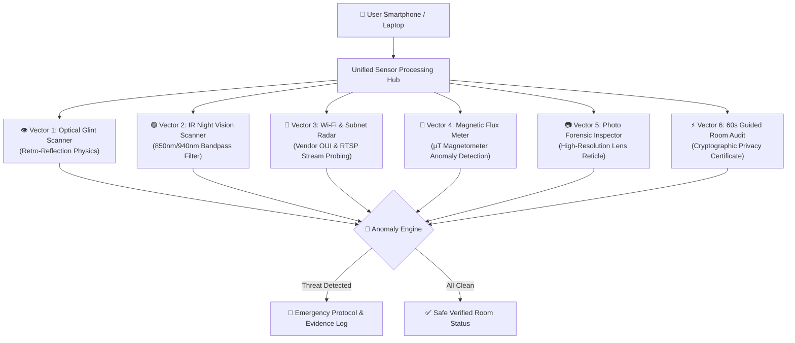

<div align="center">

# 🛡️ SpyZero
### Multi-Vector Hardware Privacy & Counter-Surveillance Platform

[](https://react.dev/)
[](https://www.typescriptlang.org/)
[](https://tailwindcss.com/)
[](https://www.python.org/)
[](https://vitejs.dev/)
[](LICENSE)
[](#-security--privacy-architecture)

<br/>

> **Uncompromising counter-surveillance suite designed to detect pinhole spy cameras, hidden audio bugs, and unauthorized streaming nodes in hotels, rental rooms, Airbnbs, and trial rooms.**

<br/>

[✨ Key Capabilities](#-key-capabilities) • [🔬 Detection Architecture](#-6-vector-detection-architecture) • [📱 Mobile QR Sync](#-instant-mobile-qr-sync) • [🚀 Quickstart](#-quickstart-guide) • [🛡️ Emergency Legal Shield](#-emergency-protocol--legal-shield) • [🗺️ Roadmap](#-roadmap)

---

</div>

<br/>

## 🎯 The Problem SpyZero Solves

Hidden surveillance devices have become dangerously miniaturized:
- **Pinhole lenses** as small as **1–2 mm** embedded in smoke detectors, digital clocks, wall sockets, and tissue boxes.
- **Covert Wi-Fi streaming nodes** streaming unauthorized RTSP/MJPEG video directly to private cloud servers.
- **Infrared night vision arrays** that illuminate private rooms in invisible 850nm / 940nm spectra.

**SpyZero** transforms your standard smartphone and laptop into an advanced hardware counter-surveillance scanner — **without requiring expensive \$500+ RF bug sweeping equipment**.

---

## 🔬 6-Vector Detection Architecture



---

## ⚡ Core Feature Matrix

| Vector / Tool | Hardware Used | Target Threat | Output & Detection Logic |
| :--- | :--- | :--- | :--- |
| **👁️ Camera Lens Glint** | Phone Camera + Flashlight | Pinhole optical lenses | Detects retro-reflection off curved glass apertures with targeting reticle |
| **🟣 IR Night Vision** | CMOS Sensor Exposure | Invisible night-vision LEDs | Bandpass spectral filtering unmasks 850nm/940nm illuminators as violet blooms |
| **📡 Wi-Fi & Network Radar** | OS Wi-Fi / ARP Subnet | Spy cam boards, RTSP streams | Matches MAC prefixes (Tuya, Espressif, Anyka, Novatek) & probes Port 554/8080 |
| **🧲 Magnetic EMF Meter** | Smartphone Magnetometer | Concealed DSPs, bug transformers | Reads live $\mu T$ magnetic flux with baseline ambient calibration & acoustic meter |
| **📷 Photo Forensic Review** | High-Res Macro Camera | Hidden drilled holes in fixtures | Manual reticle inspection of screws, smoke alarms, clocks, and AC plugs |
| **📜 60s Guided Audit** | Multi-sensor automated sweep | Room-wide privacy scan | 4-step wizard with verifiable timestamped room privacy report |

---

## 📱 Instant Mobile QR Sync

SpyZero features a zero-install **Real-Phone Sync** protocol. You can run SpyZero on your laptop and instantly transfer native sensor control to your iPhone or Android device.

```
[ Laptop / Desktop Dashboard ]
            │
            ▼
    [ Connect Phone Modal ]
            │
            ├─► Generates local Wi-Fi QR Code (e.g., http://192.168.0.102:5173)
            │
            ▼
[ Scan with Phone Camera / Google Lens ]
            │
            ▼
[ SpyZero Launches on Mobile Safari/Chrome ]
  (Instant access to native camera, torch, and magnetometer!)
```

> [!TIP]
> **Fullscreen App Experience:** On your phone browser, tap **"Share > Add to Home Screen"** to launch SpyZero as a clean, full-screen native mobile application without browser toolbars.

---

## 🔍 In-Depth Detection Breakdown

<details>
<summary><b>👁️ Vector 1: Optical Lens Glint Detection (Physics & Optics)</b></summary>
<br/>

Hidden pinhole cameras utilize compound glass or plastic lens elements. When a light source (such as your phone's flashlight) is positioned close to the camera sensor axis (**coaxial illumination**), light passes through the aperture, reflects off the reflective image sensor substrate at the focal plane, and returns directly along the path of illumination (**retro-reflection**).

- **How it works in SpyZero:**
  - Employs live camera feed with an integrated high-output screen / LED torch.
  - Highlights specular glint reflections with an optical targeting HUD.
  - Works effectively up to 3 meters in darkened rooms.
</details>

<details>
<summary><b>📡 Vector 2: Wi-Fi & Network Subnet Radar</b></summary>
<br/>

Covert surveillance devices must transmit captured footage. 90%+ of consumer spy cameras use off-the-shelf Chinese IoT chipsets that connect to the local Wi-Fi router.

- **SpyZero's Native Engine:**
  - Queries OS-level network interfaces via Windows/Linux native commands (`netsh`, `arp -a`).
  - Matches MAC Organizationally Unique Identifiers (OUIs) against a signature database of known spy camera manufacturers:
    - **Tuya Smart** (`D8:1F:12`)
    - **Espressif Systems / ESP32-CAM** (`CC:32:E5`, `A4:CF:12`)
    - **Anyka Surveillance Microelectronics** (`00:12:16`)
    - **Novatek Microelectronics** (`88:12:4E`)
  - Identifies active unauthenticated RTSP video streams (Port 554) and MJPEG feeds (Port 8080).
</details>

<details>
<summary><b>🧲 Vector 3: Magnetic EMF Flux Sensor (Magnetometer)</b></summary>
<br/>

Active electronics, switching regulators, micro-transformers, and covert microphone preamps generate localized electromagnetic fields ($\mu T$). Normal wooden headboards, stuffed toys, or plastic tissue boxes have an ambient reading of **25–45 $\mu T$**. If a concealed bug or camera circuit is inside, the reading surges to **80–200+ $\mu T$**.

- **How SpyZero uses it:**
  - Interacts directly with the device's 3-axis Hall-effect magnetometer (`Sensor API`).
  - Features an **Ambient Zero-Calibration** button to tare the local earth magnetic field.
  - Produces real-time acoustic clicks (Geiger counter emulation) with haptic vibrations that accelerate upon proximity.
</details>

<details>
<summary><b>🟣 Vector 4: Infrared (IR) Night-Vision Unmasking</b></summary>
<br/>

Most covert cameras are equipped with 850nm or 940nm infrared LEDs for night illumination. While invisible to the naked human eye, smartphone CMOS camera sensors without strong IR cut filters can perceive this wavelength.

- **SpyZero's Night IR Mode:**
  - Amplifies red and blue chromatic values where IR emission typically blooms.
  - Renders invisible IR LED emitters as bright magenta/violet illumination points in pitch darkness.
</details>

---

## 🚨 Emergency Protocol & Legal Shield

When SpyZero detects a covert surveillance node, it immediately provides a non-destructive forensic incident workflow:

1. **Digital Forensic Evidence Generation:**
   - Automatically compiles device MAC address, IP, open streaming ports, signal strength, and cryptographic incident hash into a timestamped evidence log.
2. **Chain of Custody Guidance:**
   - Immediate on-screen warning: *"Do not wipe, clean, or move the device (preserves physical fingerprints for law enforcement)."*
3. **Direct One-Touch Emergency Helplines:**
   - 🚔 **112** (National Emergency Services)
   - 🛡️ **1091** (Women's Safety Hotline)
   - 💻 **1930** (National Cyber Crime Reporting Portal)

---

## 🚀 Quickstart Guide

### Prerequisites
- **Node.js** (v18 or higher)
- **Python** (v3.9 or higher, standard library only)
- Both laptop and mobile phone connected to the **same Wi-Fi network**.

### 1. Clone & Install Frontend
```bash
# Clone the repository
git clone https://github.com/Kavin-124/SpyZero.git
cd SpyZero

# Install dependencies
npm install

# Start Vite dev server on local network
npm run dev
```

### 2. Start Hardware Scanner Bridge (Optional for Native OS Scans)
In a separate terminal window:
```bash
python backend/real_scanner.py
```
> The native scanner runs on `http://localhost:8000` using standard Python libraries — **zero `pip install` required!**

### 3. Open SpyZero
- Open [http://localhost:5173](http://localhost:5173) in your browser.
- Switch between **Mobile App View** and **Desktop Dashboard** via the top bar.
- Click **"Connect Phone"** to scan the QR code with your mobile camera and start room sweeping!

---

## 🔒 Security & Privacy Architecture

- **100% Client-Side Video Processing:** Camera frames captured for glint and IR analysis are processed strictly in-memory on the device canvas. **No image or video is ever uploaded to external servers.**
- **No Account Required:** Immediate protection with zero sign-up, tracking cookies, or personal data collection.
- **Open-Source Auditable Code:** Full transparency for travelers, security professionals, and white-hat researchers.

---

## 🗺️ Roadmap

- [x] Modern Matte Zinc UI (Mobile Phone Chassis + Desktop Widescreen).
- [x] Optical Lens Glint Reflection Scanner with HUD reticle.
- [x] Infrared (IR) 850nm spectral night-vision enhancement.
- [x] Native OS Wi-Fi scanner and IoT OUI chipset identification.
- [x] Digital Magnetic Flux ($\mu T$) Geiger meter with acoustic clicks.
- [x] Instant local Wi-Fi QR code sync for real smartphones.
- [x] 60-Second Guided Room Audit wizard with verifiable reports.
- [x] One-touch Emergency Forensic Shield and legal helplines.
- [x] Bluetooth Low Energy (BLE) tracker detector (AirTags, Tile, SmartTags).
- [x] Live RTSP / ONVIF video stream intercept player inside network radar.
- [x] Progressive Web App (PWA) offline service worker caching.
- [x] Ultrasonic & Coil Whine acoustic bug sweeper (15kHz–22kHz spectrum analyzer).
- [ ] Crowdsourced community hotel privacy rating database.
- [ ] Export forensic audit report in encrypted PDF format.

---

## 📜 License & Disclaimer

Distributed under the **MIT License**. See `LICENSE` for more information.

> **Disclaimer:** SpyZero is designed as a personal defense utility for counter-surveillance and traveler safety. Users must comply with local privacy regulations and laws regarding network probing and device scanning.

<br/>

<div align="center">
  <sub>Built with ❤️ for privacy, traveler security, and digital safety.</sub>
</div>
