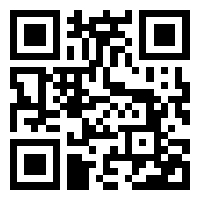
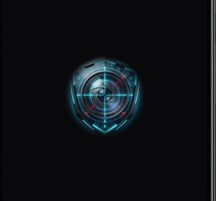
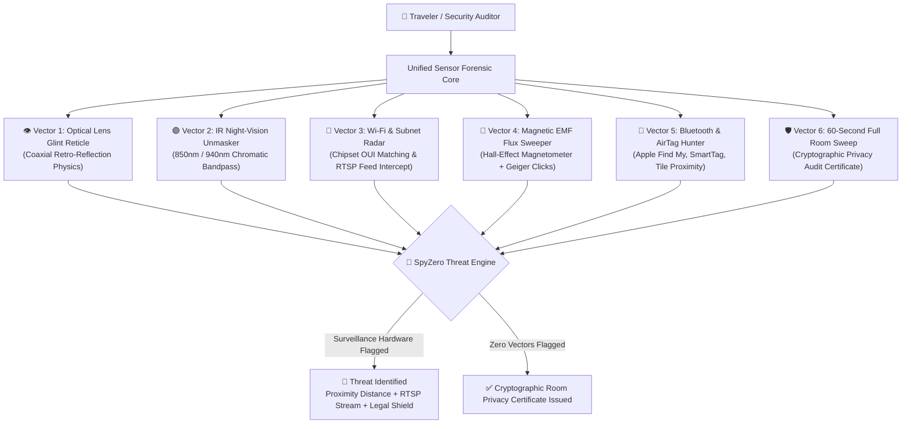

<div align="center">


# 🛡️ SpyZero
### Multi-Vector Counter-Surveillance & Hardware Forensics Engine

**Military-Grade Privacy Defense for Hotels, Airbnbs, Trial Rooms & Private Spaces**

<br/>

[-00C853?style=for-the-badge&logo=android&logoColor=white)](https://tinyurl.com/29nqw9mz)
[](#-apple-ios-installation-guide)
[](https://react.dev/)
[](https://capacitorjs.com/)
[](https://www.typescriptlang.org/)
[](https://tailwindcss.com/)
[](#-security--privacy-architecture)
[](LICENSE)

<br/>

> **SpyZero** transforms your standard Android or iOS smartphone into an advanced hardware counter-surveillance suite. It detects concealed **1–2mm pinhole lenses, unmasking invisible 850nm/940nm night-vision infrared arrays, intercepting unauthorized RTSP Wi-Fi video streaming boards, locating clandestine Apple AirTags/SmartTags, and detecting magnetic EMF radiation from hidden listening bugs** — *without requiring $500+ commercial RF bug detectors.*

<br/>

[📥 Instant Download](#-instant-mobile-installation--download) • [🎯 Why SpyZero](#-why-spyzero-vs-hardware-sweepers) • [📱 UI Showcase](#-mobile-interface-showcase) • [🔬 6-Vector Suite](#-the-6-vector-counter-surveillance-suite) • [📋 3-Min Protocol](#-traveler-cheatsheet-the-3-minute-room-sweep) • [🚨 Emergency Shield](#-emergency-protocol--evidence-chain) • [🛠️ Developer Setup](#-developer-quickstart)

---

</div>

<br/>

## 📥 Instant Mobile Installation & Download

Get SpyZero running on your phone in under 30 seconds. Zero account creation. Zero telemetry.

<table>
<tr>
<td width="65%" valign="top">

### 🤖 Android Installation (Choose Either Method)

* **Method 1: Direct File Share (Clean `SpyZero.apk`)**
  * The pre-compiled APK is included directly inside the repository:
    ```text
    ./SpyZero.apk
    ```
  * Send this file directly to your phone via WhatsApp Web, Telegram, or Google Drive, and tap **Install**.

* **Method 2: 1-Tap Chrome Browser Download (Recommended)**
  * Open Google Chrome on your phone and tap the direct download link:
    <div align="left" style="margin: 12px 0;">
      <a href="https://tinyurl.com/29nqw9mz">
        
      </a>
    </div>
  * Direct Link: **[`https://tinyurl.com/29nqw9mz`](https://tinyurl.com/29nqw9mz)** *(or GitHub mirror: `https://github.com/Kavin-124/SpyZero/raw/main/SpyZero.apk`)*.
  * When Chrome alerts *"File might be harmful / Download anyway?"*, tap **Download anyway**.
  * Tap the downloaded notification and select **Install** *(Allow "Install from unknown sources" if prompted)*.

---

### 🍏 Apple iOS Installation Guide

* **Option A: Instant PWA "Add to Home Screen" (100% Free & Fast)**
  1. Open your SpyZero web URL in **Safari** on your iPhone.
  2. Tap the **Share icon** *(Square with arrow pointing up ⬆️)* at the bottom.
  3. Scroll down and tap **"Add to Home Screen"** ➔ Tap **Add**.
  4. The **SpyZero** native app icon appears on your home screen with full-screen sensor access!
* **Option B: Native Capacitor iOS Build (Mac + Xcode)**
  ```bash
  npx cap add ios && npx cap sync ios && npx cap open ios
  ```
  Connect your iPhone via USB, select your free Personal Apple ID, and hit **Run (▶️)**.

</td>
<td width="35%" align="center" valign="middle" style="background-color: #0d1117; border-radius: 16px; padding: 16px;">

<h4 style="margin-top: 0;">📱 Scan to Download APK</h4>



<p style="font-size: 11px; color: #8b949e; margin-top: 10px; line-height: 1.4;">
Point your phone camera at this QR code to download <b>SpyZero.apk</b> directly to your Android device.
</p>

</td>
</tr>
</table>

---

## 🎯 Why SpyZero? vs Hardware Sweepers

| Metric / Capability | 🛡️ SpyZero (Mobile Suite) | 📟 Commercial RF Sweepers ($400–$1,200) | 📱 Generic Store Apps |
| :--- | :--- | :--- | :--- |
| **Total Cost** | **100% Free & Open-Source** | Expensive hardware (\$400 – \$1,200+) | Full-screen paywalls & ads |
| **Hardware Required** | **Your standard smartphone** | Bulky, specialized receiver box | Smartphone |
| **Optical Lens Glint Detection** | **Yes (Coaxial Flash + HUD Reticle)** | Optical peephole only | None / Fake filters |
| **850nm/940nm Night IR Unmasking** | **Yes (CMOS Bandpass Exposure)** | Separate IR detector card required | None |
| **Wi-Fi Camera MAC OUI Identification** | **Yes (Tuya, Espressif, Anyka, Novatek)** | Only detects generic RF frequency | None |
| **Live RTSP Video Stream Intercept** | **Yes (Probes Port 554 & Displays Feed)** | No (Cannot decode video frames) | None |
| **BLE Stalker Tag Hunter (AirTags/Tiles)** | **Yes (Proximity RSSI Distance Meter)** | Cannot identify Bluetooth beacon IDs | None |
| **Magnetic EMF Anomaly Geiger Meter** | **Yes (Hall-effect Sensor + Audio Clicks)** | Requires dedicated magnetometer probe | Basic numerical display |
| **Cryptographic Room Audit Certificate** | **Yes (SHA-256 Hash + Printable Certificate)**| None | None |
| **Privacy & Zero-Cloud Guarantee** | **100% On-Device / Zero Telemetry** | Hardware offline | Uploads telemetry & location |

---

## 📱 Mobile Interface Showcase

<div align="center">

| 🚀 Cyber Splash Screen | 📶 Wi-Fi & Network Radar |
| :---: | :---: |
|  |  |
| *Hardware-calibrated Splash branding with circular emblem* | *Real-time Wi-Fi AP sweep, distance attenuation & RTSP prober* |

</div>

---

## 🔬 The 6-Vector Counter-Surveillance Suite



### 👁️ Vector 1: Coaxial Optical Lens Glint Retro-Reflection
Concealed pinhole cameras use compound glass or acrylic optical lenses. SpyZero utilizes your smartphone's flashlight in tight coaxial alignment with the CMOS camera sensor:
* Light travels into the 1–2mm pinhole aperture, focuses onto the camera's image sensor substrate, and bounces straight back along the path of illumination (**retro-reflection**).
* SpyZero's targeting HUD visualizes these specular pinpoint returns with an optical lock-on reticle, distinguishing lens reflections from benign surface glares.

### 🟣 Vector 2: Infrared (IR) Night-Vision Spectrum Unmasker
Most covert cameras feature 850nm or 940nm infrared LEDs for low-light recording. While totally invisible to human eyes, standard smartphone CMOS sensors pick up near-infrared photons:
* SpyZero's chromatic bandpass engine strips ambient noise and amplifies infrared photon flares into high-contrast magenta and violet points of light.
* Instantly reveals hidden camera emitters hidden behind tinted glass, clocks, and television bezels in pitch-black rooms.

### 📶 Vector 3: Wi-Fi & Subnet Radar with RTSP Video Interception
Covert IP surveillance cameras must broadcast an access point or connect to the local LAN to transmit video:
* **Rogue Beacon Hunter:** Detects unencrypted ad-hoc camera APs broadcasting nearby (e.g., `CAM_A9_xxxx`, `IPC-Mini`, `Tuya-xxx`).
* **Subnet OUI Signature Matching:** Analyzes local subnet MAC addresses against a curated database of known surveillance micro-chipsets:
  * `D8:1F:12` ➔ Tuya Smart (Spy Cam Controller)
  * `CC:32:E5` / `A4:CF:12` ➔ Espressif Systems (ESP32-CAM Pinhole)
  * `00:12:16` ➔ Anyka Surveillance Microelectronics
  * `88:12:4E` ➔ Novatek Microelectronics
* **RTSP Video Interceptor:** Probes Port 554 (RTSP) and Port 8080 (MJPEG) on identified hardware and displays the live intercepted video frame feed directly inside the app!

### 🧲 Vector 4: 3-Axis Magnetic EMF Flux Sweeper (with Geiger Clicks)
Every powered surveillance device, covert microphone preamp, switching regulator, and wire transmitter emits an electromagnetic field ($\mu T$):
* Reads raw 3-axis magnetic flux data from your phone's built-in Hall-effect sensor.
* Features **Ambient Tare Calibration** to zero out natural Earth background magnetism.
* Accelerating acoustic Geiger counter audio and haptic pulses guide you directly to hidden bugs inside wooden headboards, walls, plush toys, and tissue boxes.

### 📡 Vector 5: Bluetooth Low Energy & AirTag Hunter
Stalker tracking tags (Apple AirTags, Samsung Galaxy SmartTags, Tile Pro) are frequently slipped into luggage, jackets, or vehicle cabins:
* Scans for unauthorized rotating BLE advertising beacons broadcasting persistent cryptographic identifiers.
* Calculates physical distance in meters using signal attenuation formulas ($d = 10^{\frac{P_{tx} - RSSI}{10n}}$) to locate tags hidden in your personal space.

### 🛡️ Vector 6: 1-Tap Room Sweep & Cryptographic Privacy Audit
A guided 60-second automated multi-vector room sweep designed for travelers:
* Sequentially audits optical reflections, RF spectrum, and magnetic anomalies across 4 critical room zones (Bed area, Bathroom/Mirrors, Smoke alarms, Electrical outlets).
* Generates a timestamped, verifiable **Cryptographic Privacy Certificate** complete with room ID, SHA-256 evidence fingerprint, and PDF print/share functionality.

---

## 📋 Traveler Cheatsheet: The 3-Minute Room Sweep

Before unpacking your bags at any hotel or Airbnb, follow this standard security routine:

```
[ Step 1: Turn off all lights ]
  └─► Open SpyZero > IR Night-Vision Scanner > Slowly pan phone around room.
      Look for bright magenta LED points on digital clocks, smoke alarms & TV bezels.

[ Step 2: Turn on lights & Flashlight ]
  └─► Open Optical Glint Scanner > Hold phone at eye level.
      Examine AC vents, shower fixtures, mirror frames & screw heads for circular glints.

[ Step 3: Proximity EMF Sweep ]
  └─► Open Magnetic Flux Meter > Tap "Zero Tare".
      Hold phone 2-5cm from bedside clock, smoke detector, power strip & decorative items.
      Listen for accelerating Geiger clicks.

[ Step 4: Network & BLE Radar ]
  └─► Tap "Scan Now" in Network Radar & BLE Hunter.
      Check for rogue camera APs (CAM_A9, Tuya), open RTSP port 554 feeds, or unknown AirTags.

[ Step 5: Export Privacy Certificate ]
  └─► Run 60s Full Room Sweep and save your Cryptographic Safety Certificate!
```

---

## 🚨 Emergency Protocol & Evidence Chain

When an active surveillance device is verified, panic is the enemy. SpyZero enforces a forensic incident preservation protocol:

```
                  🚨 SURVEILLANCE THREAT CONFIRMED 🚨
                                  │
      ┌───────────────────────────┴───────────────────────────┐
      ▼                                                       ▼
[ 1. Digital Forensic Evidence ]            [ 2. Physical Evidence Preservation ]
- Timestamped MAC & IP Log                  - "DO NOT touch, move, or wipe device."
- RTSP Streaming Port Capture               - Preserves latent fingerprint DNA.
- SHA-256 Cryptographic Hash               - Take room-context photographs.
      │                                                       │
      └───────────────────────────┬───────────────────────────┘
                                  ▼
                   [ 3. One-Touch Emergency Call ]
        🚔 112 (National Police) • 🛡️ 1091 (Women's Safety)
                  💻 1930 (Cyber Crime Reporting)
```

---

## 🔒 Security & Privacy Architecture

* **100% Client-Side Processing:** All optical video frames and camera feeds are analyzed in volatile memory via HTML5 Canvas. **No video, image, audio, or biometric data is ever stored on or transmitted to external servers.**
* **Zero External Cloud Dependencies:** Core sensors (Optical, IR, Magnetometer, Bluetooth) operate flawlessly with **zero internet connection** (even in Airplane mode).
* **Zero Accounts / Zero Telemetry:** No user registrations, no tracking cookies, and no analytics SDKs.

---

## 🛠️ Developer Quickstart

### Prerequisites
* **Node.js** (v18.x or higher)
* **Android Studio** *(for native Android APK building)*

### 1. Clone & Install
```bash
git clone https://github.com/Kavin-124/SpyZero.git
cd SpyZero
npm install
```

### 2. Run Local Development Server
```bash
# Starts Vite with local Wi-Fi exposure for mobile testing
npm run dev -- --host
```

### 3. Build & Sync to Android
```bash
npm run build
npx cap sync android
```

### 4. Build Standalone APK via Command Line
```bash
cd android
./gradlew assembleDebug
```
The compiled APK will be generated at:
`android/app/build/outputs/apk/debug/app-debug.apk`

---

## 📜 License & Legal Disclaimer

Distributed under the **MIT License**. See [`LICENSE`](./LICENSE) for full details.

> **Legal Disclaimer:** SpyZero is developed as a defensive counter-surveillance and personal privacy utility. Users must comply with all local laws and privacy regulations regarding network probing and wireless spectrum analysis. The authors assume no liability for unauthorized usage.

<br/>

<div align="center">
  <sub>Designed & engineered with ❤️ for personal privacy, human safety, and traveler security.</sub>
</div>
